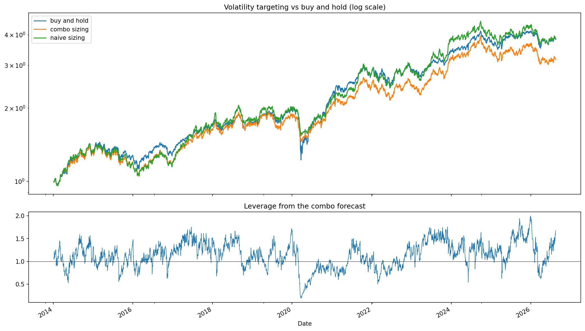
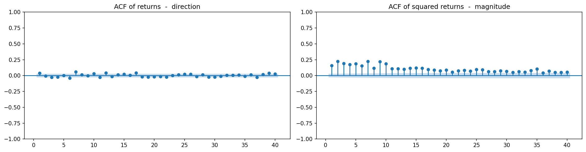

# Forecasting Nifty 50 Volatility

**A 27% out-of-sample improvement over a zero-parameter baseline that does not survive transaction costs.**

This project forecasts 20-day-ahead realized volatility of the Nifty 50 using HAR,
GJR-GARCH and India VIX, validates the models with expanding-window walk-forward
testing, and then asks the question most volatility projects skip: does the
statistical edge actually make money?

It does not. That negative result, and the reasons behind it, is the main finding.

---

## Results

### Forecast accuracy — out-of-sample, walk-forward, refit annually

3,084 trading days, January 2014 to August 2026. Lower QLIKE is better.

| Model | QLIKE | RMSE | vs naive |
|---|---|---|---|
| **HAR + India VIX** | **0.2611** | 0.0628 | **26.6%** |
| India VIX (raw, nothing fitted) | 0.2702 | 0.0700 | 24.0% |
| India VIX (de-biased) | 0.2724 | 0.0637 | 23.4% |
| HAR-L (with leverage feature) | 0.2739 | 0.0677 | 23.0% |
| HAR | 0.2744 | 0.0674 | 22.8% |
| GJR-GARCH(1,1)-t | 0.2867 | 0.0761 | 19.4% |
| EWMA (λ = 0.94) | 0.3411 | 0.0768 | 4.1% |
| Naive persistence | 0.3555 | 0.0788 | — |

Diebold-Mariano tests, HAC-corrected for the 20-day overlapping windows:

| Comparison | t | p |
|---|---|---|
| naive vs HAR | 3.16 | 0.0016 |
| naive vs HAR+VIX | 2.76 | 0.0058 |
| HAR vs HAR+VIX | 0.69 | 0.488 |
| VIX vs HAR+VIX | 1.15 | 0.249 |

The edge over the baseline is real and significant. The edge over India VIX
alone is not.

### Economic test — volatility targeting on Nifty

`position size = target_vol / forecast_vol`, capped at 2x, costs charged on
turnover at 5bps.

| Strategy | CAGR | Vol | Sharpe | Max DD | Calmar |
|---|---|---|---|---|---|
| Buy and hold | 11.59% | 16.00% | **0.77** | −38.4% | 0.32 |
| Sized by HAR+VIX model | 9.86% | 14.94% | 0.70 | −25.9% | 0.41 |
| Sized by raw India VIX | 9.16% | 12.82% | 0.75 | **−21.8%** | 0.44 |
| Sized by naive (free) | 11.65% | 16.32% | 0.76 | −26.2% | **0.47** |



**The better forecast lost to the free one.** The model turned over 14.9x a year
and gave up 9.1% of cumulative return to costs; the naive 20-day rolling estimate
is mechanically smoother and traded far less. Moving from 5bps to 20bps of cost
drops the model's Sharpe from 0.70 to 0.56.

The drawdown reduction against buy and hold is real — but it comes from the
*technique*, not the model. Any volatility estimate delivers it, and the free one
delivers it more cheaply.

---

## Why volatility and not returns



Same test, same data, opposite answers. Return autocorrelations sit near zero at
every lag. Squared-return autocorrelation — magnitude with the sign stripped out
— starts around 0.25 and is still positive at lag 40.

A predictable direction gets arbitraged away: everyone buys today and the move
disappears. Predictable turbulence cannot be, because knowing *that* next week is
violent without knowing *which way* gives you no position to take.

---

## Key findings

**1 · India VIX and historical models fail on opposite risks.**
The clearest result in the project, visible only in the year-by-year breakdown:

| Year | naive | HAR | GJR-GARCH | raw VIX |
|---|---|---|---|---|
| 2024 — scheduled election | 0.852 | 0.389 | 0.433 | **0.172** |
| 2020 — unscheduled shock | 1.205 | 1.108 | **0.930** | 1.434 |

The June 2024 general election was a known date with known uncertainty, so
options priced it in advance while every backward-looking model was blind.
COVID was priced by nobody, and once it hit, implied volatility overshot while a
mean-reverting model tracked the decay better. Implied volatility wins on known
risk and loses on surprise risk.

**2 · An insignificant coefficient was measurement noise, not absence of information.**
With close-to-close features the daily HAR term is near zero and insignificant,
which reads like "one day tells you nothing over a 20-day horizon." Rebuilt on
Garman-Klass — roughly 7x more statistically efficient — the same term is an
order of magnitude larger and strongly significant. The efficient estimator
recovered a signal the noisy one had drowned.

**3 · About a quarter of Nifty variance is created overnight.**
Parkinson and Garman-Klass both assume prices move continuously, so both miss
the open-vs-previous-close gap. Global markets trade while the NSE is shut.
Either estimator understates Indian equity risk unless an overnight term is
added, which this project does.

**4 · The leverage effect is sharply horizon-dependent.**
In GJR-GARCH the asymmetry term is among the model's strongest parameters
(p ≈ 1e-12) and roughly 17x the size of the symmetric term, which is itself
insignificant — Nifty volatility is made almost entirely of falls. As a 20-day
HAR feature the same effect is insignificant (p ≈ 0.20). Falls drive volatility
tomorrow, not next month, and a daily risk model should not be imported into a
monthly one unchanged.

**5 · India VIX carries an ~18% premium with a slope near 1.**
Regressing realized on implied gives a slope of 0.98 with 1.0 inside the
confidence interval, and the entire bias in the intercept. The market prices the
*shape* of volatility almost exactly right and charges a constant premium on top.
That premium is the volatility risk premium — compensation for carrying tail
risk, not an inefficiency to harvest.

**6 · The in-sample ranking did not survive.**
GJR-GARCH led in-sample and trailed out-of-sample, degrading roughly three times
more than HAR: five parameters from non-linear maximum likelihood overfit more
readily than four from linear OLS, and GARCH is trained at a 1-day horizon then
extrapolated to 20. A three-variable linear regression beating maximum-likelihood
GARCH out-of-sample is the standard result in this literature (Corsi, 2009),
reproduced here on Nifty 50.

**7 · Raw VIX roughly matches the entire modelling pipeline**, and de-biasing it
made it slightly worse out-of-sample. The cost of estimating one parameter
exceeded its benefit.

---

## Method

| | |
|---|---|
| **Target** | 20-day forward realized volatility, annualised, close-to-close |
| **Estimators** | Close-to-close, Parkinson, Garman-Klass, Garman-Klass + overnight |
| **Models** | Naive, EWMA(0.94), GJR-GARCH(1,1)-t, HAR, HAR-L, VIX, HAR+VIX |
| **Loss** | QLIKE primary, RMSE secondary |
| **Validation** | Expanding-window walk-forward, refit each January, 2014-2026 |
| **Significance** | Diebold-Mariano with HAC (Newey-West) standard errors |
| **Economic test** | Volatility targeting with turnover and cost accounting |

A few choices that mattered more than the model selection:

- **QLIKE over RMSE.** Forecast errors run 3-4 points in calm markets and 60+ in
  crises. RMSE squares them, so a single crisis day carries the weight of ~400
  calm days and the comparison becomes a comparison over March 2020 alone. QLIKE
  works on the ratio instead, and penalises under-forecasting more heavily —
  matching the economics of being caught short of risk before a crash.

- **Log-normal retransformation bias.** Models are fitted in logs, and
  `exp(prediction)` recovers the median rather than the mean, under-forecasting
  by about 6%. Adding σ²/2 before exponentiating improved QLIKE by 8.4% —
  comparable to the entire gain from switching models.

- **HAC standard errors throughout.** Consecutive 20-day targets share 19 of
  20 days, so 3,000 rows hold only ~150 independent observations. An uncorrected
  t-test returned t ≈ 12 on a comparison whose corrected value was ≈ 2.8.

- **A leakage gap in training.** Each training set drops its final 20 rows,
  whose targets are built from returns inside the test year.

---

## Limitations

- Single index. Nothing here is tested on individual stocks or other markets.
- Annual refit cadence only. **Turnover-aware sizing — rebalance bands or
  smoothed leverage — is the obvious next test**, since costs rather than
  accuracy are what killed the strategy, and it was not attempted.
- Long-only, capped at 2x leverage. Options-based expressions of a volatility
  view are untested.
- The backtest covers 2014-2026, a period dominated by a bull market and one
  extreme crash. Conclusions about volatility targeting are period-specific.

---

## Reproducing

```bash
git clone https://github.com/mayureshchaturvedi/nifty-volatility-forecasting.git
cd nifty-volatility-forecasting

python -m venv venv
source venv/bin/activate          # Windows: venv\Scripts\activate
pip install -r requirements.txt

jupyter lab notebooks/nifty_volatility_forecasting.ipynb
```

Then run all cells. Data downloads from Yahoo Finance at runtime, so numbers
will extend as new data arrives. Figures are written to `figures/`.

Full runtime is roughly 10-15 minutes; GJR-GARCH is refit 13 times in the
walk-forward loop.

---

## Repository layout

```
├── notebooks/
│   └── nifty_volatility_forecasting.ipynb    # the full analysis
├── figures/                                   # generated on run
├── requirements.txt
└── README.md
```

The notebook opens with a naming-conventions reference — worth reading first,
particularly the distinction between `rv_*` columns (daily variance) and
everything else (annualised volatility).

## References

- Corsi, F. (2009). *A Simple Approximate Long-Memory Model of Realized Volatility.*
- Patton, A. (2011). *Volatility forecast comparison using imperfect volatility proxies.*
- Garman, M. & Klass, M. (1980). *On the Estimation of Security Price Volatilities from Historical Data.*
- Glosten, Jagannathan & Runkle (1993). *On the Relation between the Expected Value and the Volatility of the Nominal Excess Return on Stocks.*

## License

MIT
